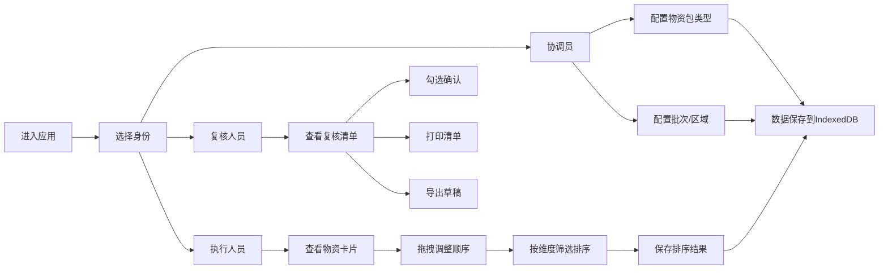

## 1. 产品概述

公益物资管理客户端工具，用于公益活动中的物资装袋顺序编排、配送批次管理和复核名单整理。支持三种角色协同工作，数据本地存储，无需后端服务。

- **主要目的**：解决公益物资分发过程中的顺序混乱、批次不清、复核困难等问题
- **目标用户**：公益活动协调员、执行人员、复核人员
- **核心价值**：提升物资装袋效率，减少分发错误，规范复核流程

## 2. 核心功能

### 2.1 用户角色

| 角色 | 进入方式 | 核心权限 |
|------|----------|----------|
| 协调员 | 身份选择进入 | 配置物资包类型、设置批次和区域、管理物资基础数据 |
| 执行人员 | 身份选择进入 | 拖拽调整装袋顺序、按批次/区域/优先级排序 |
| 复核人员 | 身份选择进入 | 查看物资清单、打印复核名单、勾选确认 |

### 2.2 功能模块

1. **身份选择页**：三种角色入口，引导用户进入对应功能界面
2. **协调员配置页**：物资包类型管理、批次设置、区域配置
3. **执行人员排序页**：物资卡片展示、拖拽排序、多维度筛选排序
4. **复核人员页**：清单展示、打印预览、复核勾选

### 2.3 页面详情

| 页面名称 | 模块名称 | 功能描述 |
|----------|----------|----------|
| 身份选择页 | 角色卡片 | 展示三种角色，点击进入对应功能页 |
| 协调员配置页 | 物资包配置 | 新增/编辑/删除物资包类型，包含名称、物品清单、优先级 |
| 协调员配置页 | 批次管理 | 配置配送批次，设置批次名称、配送时间 |
| 协调员配置页 | 区域管理 | 配置配送区域，设置区域名称、优先级 |
| 执行人员排序页 | 物资卡片列表 | 展示所有物资卡片，显示批次、区域、优先级信息 |
| 执行人员排序页 | 拖拽排序 | 支持鼠标拖拽调整物资卡片顺序 |
| 执行人员排序页 | 筛选排序 | 按批次、区域、优先级快速筛选和排序 |
| 复核人员页 | 清单展示 | 按批次分组展示物资清单，包含勾选栏和复核栏 |
| 复核人员页 | 打印功能 | 打印预览，按批次分页，隐藏编辑控件 |
| 复核人员页 | 导出功能 | 导出本次草稿为 JSON 文件 |

## 3. 核心流程

## 4. 用户界面设计

### 4.1 设计风格

- **主色调**：温暖的公益绿色 (#2E7D32)，传递公益、温暖、希望的感觉
- **辅助色**：橙色 (#FF9800) 用于强调和操作按钮，蓝色 (#1976D2) 用于信息展示
- **中性色**：浅灰背景 (#F5F5F5)，白色卡片 (#FFFFFF)，深灰文字 (#333333)
- **按钮风格**：圆角矩形，柔和阴影，悬停时有轻微放大效果
- **字体**：使用系统无衬线字体，中文优先使用微软雅黑/苹方
- **布局风格**：卡片式布局，清晰的区域分隔，充足的留白
- **图标风格**：使用简洁的线性图标，保持统一风格

### 4.2 页面设计概述

| 页面名称 | 模块名称 | UI 元素 |
|----------|----------|---------|
| 身份选择页 | 角色卡片 | 三列等宽卡片，图标+标题+描述，悬停上浮效果，柔和阴影 |
| 协调员配置页 | 配置面板 | 三栏布局（物资包、批次、区域），Tab 切换，表单弹窗 |
| 执行人员排序页 | 卡片列表 | 瀑布流/网格布局，拖拽手柄，批次/区域标签，优先级角标 |
| 复核人员页 | 清单表格 | 按批次分组的表格，复选框列，复核签字栏，操作按钮固定在顶部 |

### 4.3 响应式设计

- **桌面优先**：主要针对 1280px 以上屏幕设计
- **平板适配**：在 768px-1280px 之间自动调整列数
- **打印适配**：专门的打印样式，A4 纸张尺寸，按批次分页

### 4.4 交互细节

- 拖拽时显示半透明预览，放置位置有提示线
- 卡片有轻微的入场动画（ staggered 延迟）
- 按钮点击有涟漪效果
- 表单提交有加载状态
- 数据保存有成功提示
