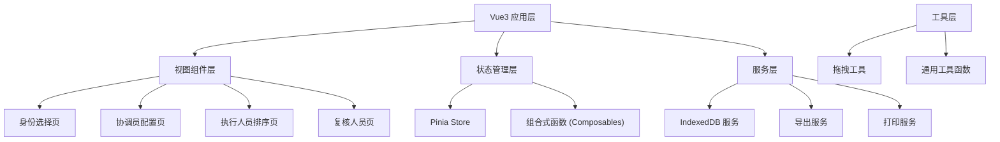
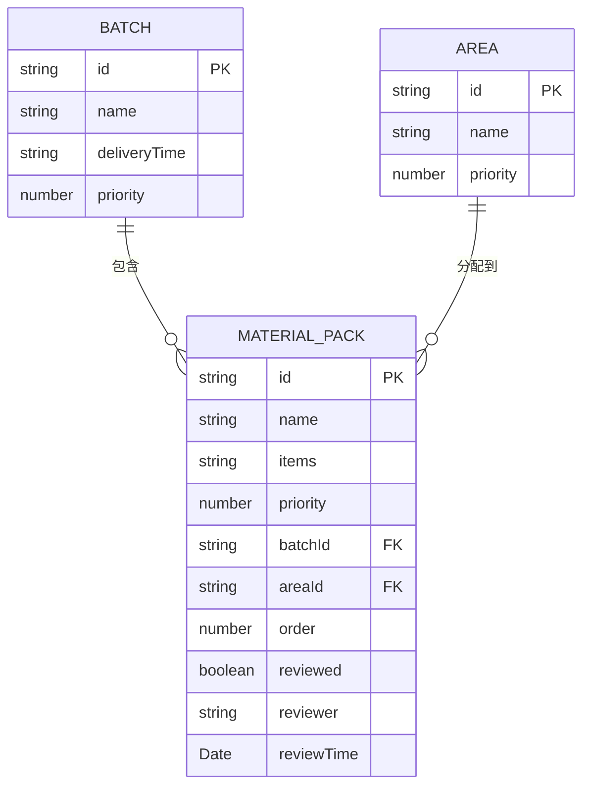

## 1. 架构设计



## 2. 技术选型说明

- **前端框架**: Vue@3.4 + TypeScript + Vite@5
- **状态管理**: Pinia@2
- **样式方案**: TailwindCSS@3
- **UI 组件**: 自定义组件 + 原生拖拽 API
- **数据存储**: IndexedDB (idb 库封装)
- **拖拽实现**: HTML5 Drag and Drop API + 自定义逻辑
- **路由**: Vue Router@4

## 3. 目录结构

```
src/
├── assets/              # 静态资源
├── components/          # 公共组件
│   ├── RoleCard.vue     # 角色卡片
│   ├── MaterialCard.vue # 物资卡片
│   ├── DraggableList.vue# 可拖拽列表
│   ├── Modal.vue        # 弹窗组件
│   └── PrintLayout.vue  # 打印布局
├── views/               # 页面视图
│   ├── RoleSelect.vue   # 身份选择页
│   ├── Coordinator.vue  # 协调员配置页
│   ├── Executor.vue     # 执行人员排序页
│   └── Reviewer.vue     # 复核人员页
├── stores/              # Pinia 状态管理
│   └── material.ts      # 物资数据 store
├── composables/         # 组合式函数
│   ├── useDragDrop.ts   # 拖拽逻辑
│   ├── useIndexedDB.ts  # IndexedDB 封装
│   └── usePrint.ts      # 打印逻辑
├── types/               # TypeScript 类型定义
│   └── index.ts         # 数据模型类型
├── utils/               # 工具函数
│   ├── export.ts        # 导出工具
│   └── helpers.ts       # 通用工具
├── router/              # 路由配置
│   └── index.ts
├── App.vue
└── main.ts
```

## 4. 路由定义

| 路由 | 页面 | 说明 |
|------|------|------|
| / | 身份选择页 | 应用入口，选择角色进入 |
| /coordinator | 协调员配置页 | 物资包、批次、区域配置 |
| /executor | 执行人员排序页 | 拖拽排序物资卡片 |
| /reviewer | 复核人员页 | 查看清单、打印、导出 |

## 5. 数据模型

### 5.1 实体关系图



### 5.2 TypeScript 类型定义

```typescript
// 物资包类型
interface MaterialPack {
  id: string;
  name: string;
  items: string[];
  priority: number; // 1-5, 1最高
  batchId: string;
  areaId: string;
  order: number;
  reviewed: boolean;
  reviewer?: string;
  reviewTime?: string;
  createdAt: string;
  updatedAt: string;
}

// 配送批次
interface Batch {
  id: string;
  name: string;
  deliveryTime: string;
  priority: number;
  createdAt: string;
}

// 配送区域
interface Area {
  id: string;
  name: string;
  priority: number;
  createdAt: string;
}

// 应用状态
interface AppState {
  materialPacks: MaterialPack[];
  batches: Batch[];
  areas: Area[];
  currentRole: 'coordinator' | 'executor' | 'reviewer' | null;
}
```

### 5.3 IndexedDB 存储结构

- **数据库名**: `charity-material-db`
- **版本**: 1
- **对象仓库**:
  - `materialPacks` (主键: id, 索引: batchId, areaId, order)
  - `batches` (主键: id)
  - `areas` (主键: id)
  - `settings` (主键: key)

## 6. 核心功能实现方案

### 6.1 拖拽排序实现

- 使用 HTML5 Drag and Drop API
- 拖拽元素设置 `draggable="true"`
- 监听 `dragstart`, `dragover`, `drop`, `dragend` 事件
- 使用数据传输对象 (`dataTransfer`) 传递拖拽元素 ID
- 拖拽过程中显示半透明的 ghost 元素
- 放置位置显示插入提示线

### 6.2 打印样式实现

- 使用 CSS `@media print` 媒体查询
- 打印时隐藏导航栏、操作按钮等非必要元素
- 使用 `page-break-after: always` 按批次分页
- 设置 A4 纸张尺寸和边距
- 保留表格的勾选栏和复核签字栏
- 打印前自动调整表格列宽以适应纸张

### 6.3 数据持久化

- 封装 IndexedDB 操作，使用 Promise 化的 API
- 应用启动时从 IndexedDB 加载数据到 Pinia store
- 数据变更时自动保存到 IndexedDB
- 支持手动导出为 JSON 文件备份
- 支持导入 JSON 文件恢复数据
